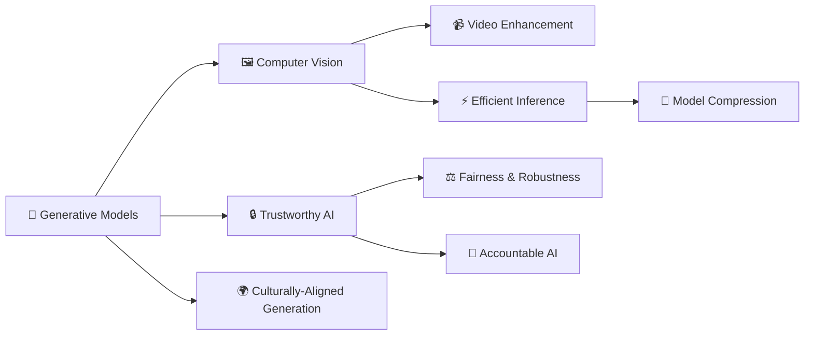

 

<!-- TODO: Uncomment and replace with your real IDs/URLs when available -->
<!-- 

 -->

  

## 🧑‍🔬 About Me

I am an AI researcher working at the intersection of **Generative Models**, **Computer Vision**, and **Trustworthy AI**. I hold an **M.Sc. in Computer Engineering** from the **University of Tehran** (GPA: 19.18/20, **ranked 1st in my cohort**) and a **B.Sc. in Computer Engineering** from the **University of Kashan** (last 2 years GPA: 18.25/20).

My work has been published in venues including **Elsevier Engineering Applications of AI (Q1, IF: 7.5)** and **IEEE Computer Architecture Letters**. I have hands-on industry experience deploying computer vision and generative AI systems at scale, and I am actively seeking **graduate research positions (M.Sc. / Ph.D.)** in AI/ML.

- 🔭 Currently working on **Trustworthy Generative AI** & **Culturally-Aligned Image Generation**
- 📝 Latest paper: **NU-Class Net** in *Elsevier EAAI* (IF: 7.5, Q1)
- 🎯 Goal: Graduate research position (M.Sc. / Ph.D.) in AI/ML
- 💬 Ask me about **Diffusion Models, GANs, Video Enhancement, Model Compression**
- 🌐 Languages: **English** (IELTS Academic 7.5) · **Persian** (Native)

## 🎓 Education

<table>
<tr>
<td><b>🏫 University of Tehran</b></td>
<td align="right">Sep 2019 – Feb 2023</td>
</tr>
<tr>
<td colspan="2">
&nbsp;&nbsp;<b>M.Sc. in Computer Engineering (Computer Architecture)</b> 
&nbsp;&nbsp;• GPA: <b>19.18/20 (3.88/4)</b> — <b>Ranked 1st</b> in cohort 
&nbsp;&nbsp;• Thesis: <i>"Designing Generative Models for Developing Deep Learning Applications in Video Compression"</i>
</td>
</tr>
<tr><td colspan="2"></td></tr>
<tr>
<td><b>🏫 University of Kashan</b></td>
<td align="right">Sep 2015 – Sep 2019</td>
</tr>
<tr>
<td colspan="2">
&nbsp;&nbsp;<b>B.Sc. in Computer Engineering (Software Engineering)</b> 
&nbsp;&nbsp;• GPA (last two years): <b>18.25/20 (3.96/4)</b> | Cumulative: <b>17.68/20 (3.81/4)</b> 
&nbsp;&nbsp;• Thesis: <i>"A Hybrid Deep Learning–SVM Classification Framework"</i>
</td>
</tr>
</table>

<table>
<tr>
<td width="50%" valign="top">

### 🔬 Research Interests
- Generative Models (Diffusion, GANs)
- Trustworthy & Accountable AI
- Computer Vision
- Multimodal Learning
- Large Language Models
- Efficient Deep Learning

</td>
<td width="50%" valign="top">

### 🏛️ Affiliations
- **University of Tehran** — Research Assistant
  - Computer Vision Lab *(Dr. Tavassolipour, Dr. Modarressi)*
  - Intelligent Architectures Lab *(Dr. Modarressi)*
  - Computational Modeling & ML Lab *(Dr. Modarressi, Dr. Sadeghi)*
- **QCRI, HBKU** — Researcher
  - *(Dr. Sadeghi, Dr. Al‑Nuaimi)*
- **University of Kashan** — Research Assistant
  - *(Dr. Salimi Sartakhti)*

</td>
</tr>
</table>

### 🗺️ Research Landscape

## 🚀 Featured Projects

<!-- TODO: Replace "YOUR-REPO-2" with an actual repository name -->

&nbsp;

## 📄 Selected Publications

| # | Title | Venue | Impact | Year |
|:-:|-------|-------|:------:|:----:|
| 1 | **NU‑Class Net: A Novel Deep Learning‑based Approach for Video Quality Enhancement** | *Eng. Applications of AI* (Elsevier) · [DOI](https://doi.org/10.1016/j.engappai.2025.110118) | **IF: 7.5, Q1** | 2025 |
| 2 | **Smart Memory: Deep Learning Acceleration in 3D‑Stacked Memories** | *IEEE Computer Architecture Letters* · [DOI](https://doi.org/10.1109/LCA.2023.3287976) | **IEEE** | 2023 |
| 3 | **Deep Learning Based on Support Vector Machines** | *5th Nat'l Conf. Distributed Computing & Big Data* | | 2019 |
| 4 | **Improving Robot Behavior in a Real‑Time Game Using the Grey Wolf Optimizer** | *2nd Int'l Computer Games Conf.* | | 2019 |

#### Preprints & Manuscripts

| # | Title | Status | Year |
|:-:|-------|--------|:----:|
| 5 | **Fanar Oryx: Culturally Aligned Image Generation for Arabic‑Islamic Visual Culture** | *Submission in preparation* | 2026 |
| 6 | **Reducing the Complexity of Deep Learning Models for EEG Analysis on Wearable Devices** | arXiv: [2606.12742](https://arxiv.org/abs/2606.12742) | 2026 |
| 7 | **Faster Wav2Vec: Improving the Inference Speed of Speech Representation Models** | *Manuscript in preparation* | 2026 |

## 🏆 Honors & Awards

<table>
<tr><td>🏆</td><td>Admitted <b>twice</b> to the Ph.D. program in Computer Science, <b>University of California, Irvine</b> (Fall 2024 &amp; Fall 2025); unable to enroll due to U.S. visa processing delays</td></tr>
<tr><td>🥇</td><td>Graduated <b>1st</b> (highest GPA) among M.Sc. Computer Engineering students, University of Tehran</td></tr>
<tr><td>⭐</td><td>Awarded direct Ph.D. admission to University of Tehran as <b>Exceptional Talent</b> (declined to pursue Ph.D. abroad)</td></tr>
<tr><td>⭐</td><td>Direct (exam‑exempt) M.Sc. admission to University of Tehran as <b>Exceptional Talent</b></td></tr>
<tr><td>⭐</td><td>Direct M.Sc. admission offers from University of Kashan &amp; Shahid Beheshti University as <b>Exceptional Talent</b></td></tr>
<tr><td>🏅</td><td>Ranked <b>2nd by GPA</b> among B.Sc. Software Engineering students, University of Kashan</td></tr>
<tr><td>🎖️</td><td>Recognized as <b>Distinguished Student</b> by the Exceptional Talents Committee, University of Kashan</td></tr>
</table>

## 🔭 Research Experience

<table>
<tr>
<td><b>📍 Computer Vision Lab</b> University of Tehran</td>
<td>Apr 2024 – Present</td>
</tr>
<tr>
<td colspan="2">
&nbsp;&nbsp;• Supervised by Dr. Mostafa Tavassolipour, Dr. Mehdi Modarressi 
&nbsp;&nbsp;• Investigating reliability and trustworthiness in generative and vision models (robustness & fairness) 
&nbsp;&nbsp;• Developing a hybrid generative–algorithmic framework for industrial carpet pattern design
</td>
</tr>
<tr><td colspan="2"></td></tr>
<tr>
<td><b>📍 Qatar Computing Research Institute (QCRI)</b> Hamad Bin Khalifa University, Doha (Remote)</td>
<td>Mar 2025 – Mar 2026</td>
</tr>
<tr>
<td colspan="2">
&nbsp;&nbsp;• Supervised by Dr. Mohammad Amin Sadeghi, Dr. Anas A. Al‑Nuaimi 
&nbsp;&nbsp;• Core contributor to Fanar — Arabic‑centric multimodal generative AI platform 
&nbsp;&nbsp;• Led culturally‑aligned image generation; built evaluation toolbox & benchmarking pipeline
</td>
</tr>
<tr><td colspan="2"></td></tr>
<tr>
<td><b>📍 Intelligent Architectures Lab</b> University of Tehran</td>
<td>Nov 2019 – Present</td>
</tr>
<tr>
<td colspan="2">
&nbsp;&nbsp;• Supervised by Dr. Mehdi Modarressi 
&nbsp;&nbsp;• Optimizing GAN inference efficiency via pruning, quantization, and hardware‑aware design 
&nbsp;&nbsp;• Designing energy‑efficient LSTMs for wearable health devices 
&nbsp;&nbsp;• Contributed to a peer‑reviewed publication on deep learning acceleration in 3D‑stacked memories (IEEE CAL, 2023)
</td>
</tr>
<tr><td colspan="2"></td></tr>
<tr>
<td><b>📍 Computational Modeling & ML Lab</b> University of Tehran</td>
<td>Jan 2020 – Mar 2023</td>
</tr>
<tr>
<td colspan="2">
&nbsp;&nbsp;• Supervised by Dr. Mehdi Modarressi, Dr. Mohammad Amin Sadeghi 
&nbsp;&nbsp;• Developed NU‑Class Net: ~7× video compression with perceptual quality preservation 
&nbsp;&nbsp;• Published in Elsevier Engineering Applications of AI (Q1)
</td>
</tr>
<tr><td colspan="2"></td></tr>
<tr>
<td><b>📍 AI Researcher</b> University of Kashan</td>
<td>2018 – 2019</td>
</tr>
<tr>
<td colspan="2">
&nbsp;&nbsp;• Supervised by Dr. Javad Salimi Sartakhti 
&nbsp;&nbsp;• Built a hybrid DNN–SVM classifier with 5% accuracy gains over baselines; basis of B.Sc. thesis and paper [3]
</td>
</tr>
<tr><td colspan="2"></td></tr>
<tr>
<td><b>📍 Augmented Reality Researcher</b> University of Kashan</td>
<td>2017 – 2019</td>
</tr>
<tr>
<td colspan="2">
&nbsp;&nbsp;• Supervised by Dr. Javad Salimi Sartakhti 
&nbsp;&nbsp;• Developed a Unity‑based AR application for surface detection and 3D object placement, validated across diverse object categories
</td>
</tr>
</table>

## 💼 Industry Experience

| Role | Organization | Period |
|------|-------------|--------|
| **Software Engineer & Board Member** | Molavi Carpet | 2015 – Present |
| **Computer Vision Developer** | ModAI | Jul 2024 – Feb 2025 |
| **Founder & Developer** | TechnoFarsh (B2B/B2C/C2C marketplace) | 2017 – 2020 |

## 🛠️ Technical Skills

<table>
<tr>
<td valign="top" width="33%">

**Languages & Frameworks**
 

 
`NumPy` `Pandas` `Julia` `R` `SQL` `VHDL` `Verilog`

</td>
<td valign="top" width="34%">

**ML & Systems**
 

 
`Model Compression` `Pruning` `Quantization`
`Distributed Training (Slurm)` `FFmpeg`

</td>
<td valign="top" width="33%">

**Web & Tools**
 

 
`Flask` `PostgreSQL` `Unity` `LaTeX`

</td>
</tr>
</table>

## 🎓 Teaching Experience

> Served as **Head Teaching Assistant**, **Teaching Assistant**, and **Teacher** for **10 courses** across two universities and a high school.

| Course | Role | Institution |
|--------|------|------------|
| Trustworthy AI | Head T.A. | University of Tehran |
| Generative Models | T.A. | University of Tehran |
| Data Analysis *(Dr. Sadeghi & Abolghasemi)* | T.A. | University of Tehran |
| Data Analysis *(Dr. Sadeghi)* | T.A. | University of Tehran |
| Neural Networks & Deep Learning | T.A. | University of Tehran |
| Machine Learning | Head T.A. | University of Kashan |
| Discrete Mathematics | Head T.A. | University of Kashan |
| Artificial Intelligence | Head T.A. | University of Kashan |
| MATLAB Laboratory | Head T.A. | University of Kashan |
| Java Programming | Teacher | Khayatzade High School |

## 💻 Selected Academic Projects

<b>7 projects spanning diffusion models, segmentation, detection, GANs, and more</b> (click to expand)

 

| Project | Year |
|---------|:----:|
| **Denoising Diffusion Probabilistic Models (DDPM)** — Implemented a DDPM from scratch for image denoising and generation, studying forward/reverse diffusion and variance scheduling | 2024 |
| **Semantic Segmentation with U‑Net** — Developed a U‑Net model for pixel‑level segmentation of road, vehicle, and pedestrian classes on a self‑driving car dataset | 2023 |
| **Car Detection with YOLO** — Built a YOLO‑based detection pipeline for street imagery, producing bounding‑box predictions on a real‑world vehicle dataset | 2022 |
| **LSTM‑Based Music Generator** — Trained a multi‑layer LSTM for multi‑genre music generation, exploring Delta‑RNN and quantization for inference efficiency | 2022 |
| **Bio‑Inspired Computing: Optimization Algorithms** — Implemented GA, PSO, K‑Means, and ACO for classical problems including ZOE and Vehicle Routing | 2021 |
| **Parkinson's Disease Classifier** — Designed and benchmarked 15 classifiers (KNN, DNN, SVM, ensembles) on a 700+ feature clinical dataset, achieving 98.3% accuracy | 2021 |
| **Generative Adversarial Networks (GAN) Suite** — Constructed and compared DCGAN, C‑GAN, SR‑GAN, and WGAN architectures, analyzing convergence and output fidelity | 2021 |

## 📜 Certifications & Workshops

<b>Certificates from Stanford, Oxford, Imperial College London, and more</b> (click to expand)

 

#### Online Courses & Certificates

| Certificate | Institution |
|-------------|-------------|
| Machine Learning Specialization | Stanford University |
| 2024 Oxford MLx Generative AI (Theory, Agents, Products) | AI for Global Goals |
| Oxford ML Summer School — Health | OxML, 2023 |
| Oxford ML Summer School — Finance & NLP | OxML, 2023 |
| Creative Thinking Tools for Success & Leadership | Imperial College London |
| Deep Learning Specialization | deeplearning.ai |
| GANs Specialization | deeplearning.ai |
| Deep Neural Networks with PyTorch | IBM |
| Professional Neuroscience & Systems | IPM School of Cognitive Science |

#### Attended Workshops

| Workshop | Institution |
|----------|-------------|
| 8th Winter Seminar Series (WSS) | Sharif University of Technology |
| ReACT 2023 | Sharif University of Technology |
| Scale TransformX | 2022 & 2021 |
| How to be a Teaching Assistant | University of Tehran |
| 6th IPM Advanced School on Computing & AI | IPM |
| 5th IPM Advanced School on Computing & AI | IPM |

## 🌱 Extracurricular Activities

<b>Writing, content creation, and community involvement</b> (click to expand)

 

<!-- TODO: Replace placeholder URLs with actual links -->
| Activity | Description |
|----------|-------------|
| ✍️ **Medium Writer** | Writing about Computer Science and Deep Learning topics |
| 🎥 **YouTube Content Creator** | Educational content on computer science topics |
| 🧠 **Neuroscience Workshop** | Member of Executives — Kashan's Introduction to Neuroscience Workshop |
| 🎓 **CESS** | Member of Executives — University of Kashan Computer Engineering Association |

## 📊 GitHub Stats

 

&nbsp;

&nbsp;

 

 

<!-- Snake animation — requires GitHub Actions setup (see instructions below) -->
<picture>
  <source media="(prefers-color-scheme: dark)" srcset="https://raw.githubusercontent.com/parhamzm/parhamzm/output/github-snake-dark.svg" />
  <source media="(prefers-color-scheme: light)" srcset="https://raw.githubusercontent.com/parhamzm/parhamzm/output/github-snake.svg" />
  
</picture>

<!--
  To enable the snake animation:
  1. Create a file at .github/workflows/snake.yml in your parhamzm/parhamzm repo
  2. Add the following workflow:

  name: Generate Snake
  on:
    schedule:
      - cron: "0 0 * * *"
    workflow_dispatch:
  jobs:
    build:
      runs-on: ubuntu-latest
      steps:
        - uses: Platane/snk@v3
          with:
            github_user_name: parhamzm
            outputs: |
              dist/github-snake.svg
              dist/github-snake-dark.svg?palette=github-dark
          env:
            GITHUB_TOKEN: ${{ secrets.GITHUB_TOKEN }}
        - uses: crazy-max/ghaction-github-pages@v3
          with:
            target_branch: output
            build_dir: dist
          env:
            GITHUB_TOKEN: ${{ secrets.GITHUB_TOKEN }}

  3. Run the workflow manually once, then it will update daily
-->

## 📬 References

<b>Academic references</b> (click to expand)

 

| Name | Title | Affiliation |
|------|-------|-------------|
| **Dr. Mehdi Modarressi** | Associate Professor | University of Tehran |
| **Dr. Javad Salimi Sartakhti** | Assistant Professor | University of Kashan |
| **Dr. Mohammad Amin Sadeghi** | Senior Scientist | Qatar Computing Research Institute (QCRI) |
| **Dr. Mostafa Tavassolipour** | Assistant Professor | University of Tehran |

*Contact information available upon request.*

  

*"Building AI systems that are not only powerful, but trustworthy and fair."*

 

